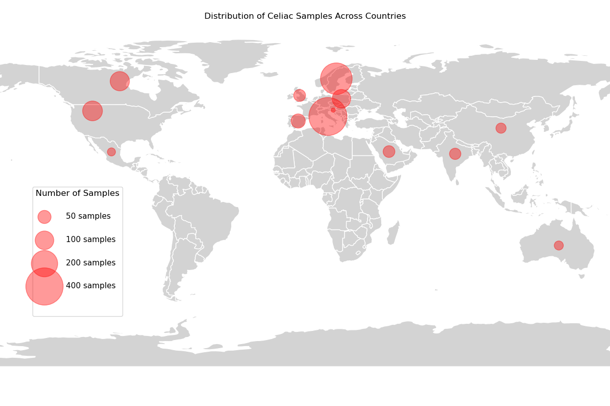
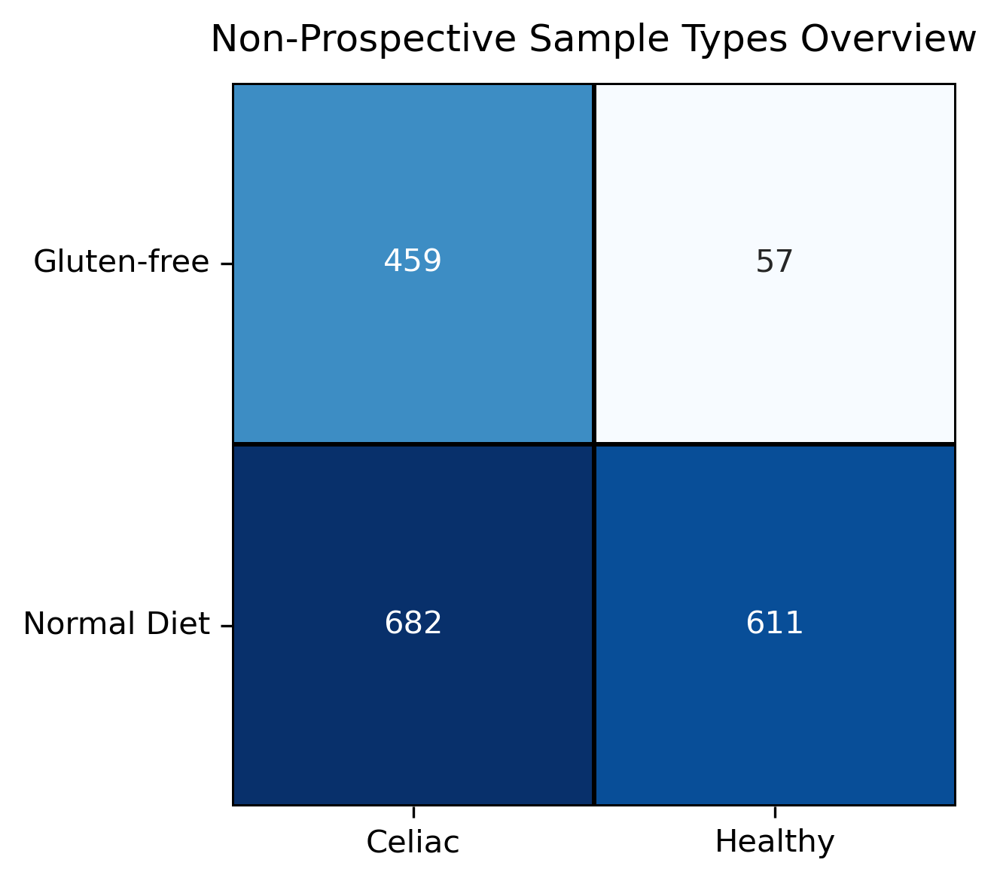
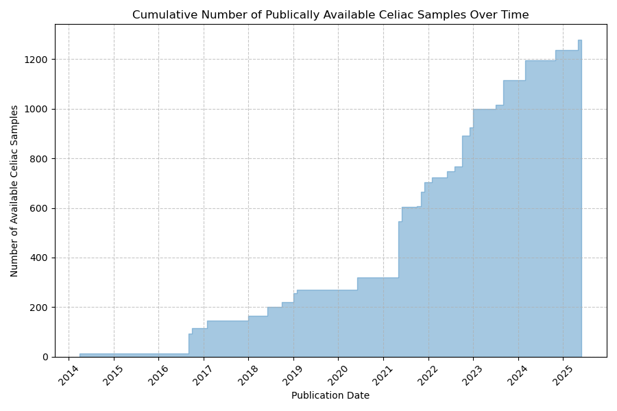
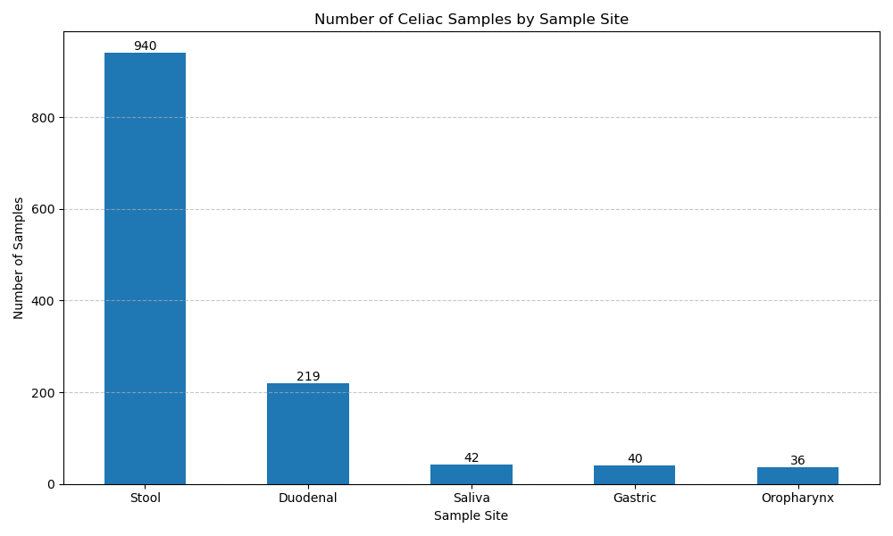

# The Celiac Microbiome Repository

[](https://doi.org/10.5281/zenodo.19029711)

## A Curated Database for Celiac Disease Gut Microbiome Research

### The Celiac Microbiome Repository
The **Celiac Microbiome Repository (CMR)** is the best effort to comprehensively combine all high throughput sequencing datasets of the gut microbiome related to celiac disease. The current version of The Celiac Microbiome Repository (CMR) is **version 1.0.1**, which was up to date as of **15th July 2025**. The CMR is a continuous project made to be easily updated as new data rapidly becomes available.

### Criteria for inclusion
This repository targets 16S rRNA and whole metagenomic sequencing datasets of the human gut microbiome described in peer-reviewed publications, which include *in vivo* samples of individuals who are diagnosed with or will be diagnosed with celiac disease. Both raw sequencing reads and basic sample metadata must be avaliable for inclusion.

### The CMR Web App
Our [R Shiny web application](https://celiac.shinyapps.io/celiac-webapp/) draws on the CMR's data, allowing for visualisation and exploration. The code behind this site is open source: [Webapp GitHub](https://github.com/CeliacMicrobiomeRepo/celiac-webapp/tree/main)

### Publication
Using 963 stool and duodenal samples from the CMR, our published cross-cohort analysis investigated the gut microbiome across the progression of celiac disease. The study included diversity analyses, differential abundance testing, and machine learning prediction of celiac disease: [Comprehensive cross-cohort analysis reveals global gut microbiome signatures of celiac disease](https://doi.org/10.1038/s43856-026-01627-1).

### Future of The CMR and Collaboration
In recent years the available celiac microbiome data has grown rapidly. If this continues, it will become increasingly challenging to comprehensively combine all of this data. However, continuing the efforts of the CMR would provide an ongoing structured collection of this data in an open source manner which saves repeated efforts.

If you are interested in extending the CMR, please get in touch (haigvbishop@gmail.com). This would involve a new literature search, processing of the data (using/building upon the already existing pipeline) and documentation of the new version.

## How to Use
Clone the repository locally and utilise it in your custom analysis or machine learning pipeline. To clone the repo:
```bash
git clone https://github.com/CeliacMicrobiomeRepo/Celiac-Microbiome-Repository.git
```

## Current Version (v1.0.1)

### Version Overview
Version 1.0.1 (up to date as of July 15th, 2025) is a metadata and documentation patch of Version 1.0, the initial comprehensive release of the celiac disease gut microbiome repository. This version includes all eligible and obtainable studies published before July 15, 2025, comprising 28 included datasets across 13 countries and 5 body sites. These datasets contain a total of 1,141 samples from individuals diagnosed with celiac disease, and 136 from individuals who would go on to develop celiac disease.

Below are visualisations summarising the data in CMR version 1.0.1.

<p align="center">
  
  
</p>

<p align="center">
  
  
</p>


### Version Documentation
Details on the current version are available on this page: [Version 1.0.1 Documentation](version_docs/repo_version_1.0.1.md). Documentation for every previous version also remains in `version_docs/`.

## Future Developments of the CMR
 - Update with the recent published data
 - Expand to functional profiling (e.g. HUMAnN 3.0, PICRUSt2)


## Contents

### Metadata
 - `included_datasets.tsv` - Contains all datasets that were included in the current version.
 - `excluded_datasets.tsv` - Contains all datasets/studies that were not able to be included despite being eligible.
 - `all_samples.tsv` - Contains all samples in the datasets in `included_datasets.tsv`.
 - `low_read_samples.tsv` - Contains all samples in `all_samples.tsv` with final read counts after DADA2 less than 1000.

### Raw Reads
The raw reads for most datasets are available on the SRA (find the SRA references in `included_datasets.tsv`). However, there were three exception in version 1.0:
 - `16S_119_Salamon` - This raw data is available on [this public database](https://portalwiedzy.cm-uj.krakow.pl/info/researchdata/UJCM77a8979a493e4aacbdceefa5121abbff/)
 - `16S_27_Fornasaro` - This raw data was obtained direct from the authors.
 - `16S_5_Senicar` - This raw data was obtained direct from the authors.

### raw_data_scripts/
The `raw_data_scripts` directory contains all Python scripts for downloading and trimming raw sequencing data.
 - `download_sra.py` - Script to automatically download raw reads from SRA and convert to FASTQ format.
 - `trim_reads.py` - Script to trim raw FASTQ reads using Trimmomatic and/or Cutadapt.

### 16S_scripts/
The `16S_scripts` directory contains R scripts used in the processing of 16S sequencing data.
 - `dada2_454.R` - Script to run DADA2 (optimised for 454)
 - `dada2_ion_torrent.R` - Script to run DADA2 (optimised for ion torrent)
 - `dada2_paired_end.R` - Script to run DADA2 (optimised for Illumina paired end)
 - `dada2_single_end.R` - Script to run DADA2 (optimised for Illumina single end)

### 16S_Datasets/
The `16S_datasets` directory contains all 16S rRNA sequencing datasets as subdirectories. Each dataset subdirectory contains the following files, largely outputs of DADA2.
- `samples.tsv` - The full CMR metadata for this dataset's samples, including `Subject_ID` (which samples come from the same participant), `Sampling_Timepoint` and `Group`. This is a filtered copy of the root `all_samples.tsv`, so a dataset directory can easily be used on its own without consulting the root tables.
- `SraAccList.csv` - A list of sample accessions from SRA
- `SraAccListReduced.csv` - Same as `SraAccList.csv` with unused samples removed
- `SraRunTable.csv` - A table of sample metadata from SRA
- `SraRunTableReduced.csv` - Same as `SraRunTable.csv` with unused samples removed
- `sra_result.csv` - A table of sample metadata from SRA
- `sra_resultReduced.csv` - Same as `sra_result.csv` with unused samples removed
- `other_metadata/` - Contain other metadata files (e.g. from authors or papers)
- `plots/` - Contains plots generated from DADA2 script
- `asv_abundances.tsv` - The ASV abundance table from DADA2 script
- `asv_abundances_transposed.tsv` - Same as `asv_abundances.tsv` but transposed
- `filter_summary.tsv` - Number of reads filtered for every fastq file
- `tracking_reads.tsv` - Number of reads at each step of DADA2 for every sample
- `sequence_lengths.tsv` - The lengths of all ASVs before applying length filter
- `taxonomy.tsv` - Taxonomic identifications of all ASVs
- `seqs.fna` - All ASV sequences in FASTA format

### SG_scripts/
The `SG_scripts` directory contains Python scripts used for processing shotgun metagenomic sequencing data. 
 - `host_read_removal.py` - Script to remove host (human) reads from the trimmed FASTQ files using Bowtie2 alignment against a human reference genome. Outputs non-host FASTQ files.
 - `tax_profiling.py` - Script to perform taxonomic profiling on the host-removed reads using MetaPhlAn 4. Outputs individual sample profiles and a merged abundance table per dataset.
 - `convert_metaphlan_gtdb.sh` - Script to convert MetaPhlAn SGB-based profiles to GTDB-based profiles.

### SG_datasets/
The `SG_datasets` directory contains processed shotgun metagenomic sequencing datasets as subdirectories. Each dataset subdirectory contains the following files and subdirectories, generated by the `SG_preprocessing_scripts`:
- `samples.tsv` - The full CMR metadata for this dataset's samples, including `Subject_ID` (which samples come from the same participant), `Sampling_Timepoint` and `Group`. This is a filtered copy of the root `all_samples.tsv`, so a dataset directory can easily be used on its own without consulting the root tables.
- `SraAccList.csv` - A list of sample accessions from SRA
- `SraAccListReduced.csv` - Same as `SraAccList.csv` with unused samples removed
- `SraRunTable.csv` - A table of sample metadata from SRA
- `SraRunTableReduced.csv` - Same as `SraRunTable.csv` with unused samples removed
- `sra_result.csv` - A table of sample metadata from SRA
- `sra_resultReduced.csv` - Same as `sra_result.csv` with unused samples removed
- `other_metadata/` - Contains other metadata files (e.g., from authors or papers).
- `host_removed_fastqs/` - Contains outputs from Bowtie2 (generated by `02_host_read_removal.py`).
    - `<sampleID>_bowtie2.log` - Log file for every Bowtie2 sample run.
- `about_host_read_removal.tsv` - Table with results from host read removal (read counts).
- `metaphlan_outputs/` - Contains outputs from MetaPhlAn (generated by `03_tax_profiling.py`).
    - `<sampleID>_profile.txt` - Individual sample taxonomic profile.
    - `gtdb/` - Contains GTDB-based profiles converted from the SGB-based profiles.
        - `<sampleID>_profile.txt` - Individual sample GTDB-based taxonomic profile.
- `merged_taxonomic_profile.tsv` - Merged table of taxonomic abundances for all samples in the dataset.


## Requirements & Licenses

The code within this repository is licensed under the **GNU Affero General Public License v3.0 (AGPL-3.0)** (see the `LICENSE` file part 1).

The curated metadata tables and processed microbiome community profiles are provided under the **Creative Commons Attribution 4.0 International (CC BY 4.0) licence** (see the `LICENSE` file part 2).

The scripts rely on several external tools and libraries, each with its own license:

### Python
[Python 3.12.2](https://www.python.org/downloads/release/python-3120/) was used for some scripts in this repository. Packages utilised include:
 - `pandas (v2.2.3)` ([BSD 3-Clause](https://github.com/pandas-dev/pandas/blob/main/LICENSE))
 - `geopandas (v1.1.1)` ([BSD 3-Clause](https://github.com/geopandas/geopandas/blob/main/LICENSE.txt))
 - `shapely (v2.1.1)` ([BSD 3-Clause](https://github.com/shapely/shapely/blob/main/LICENSE.txt))
 - `matplotlib (v3.10.0)` ([PSF license](https://github.com/matplotlib/matplotlib/blob/main/LICENSE/LICENSE))
 - `numpy (v1.26.4)` ([BSD 3-Clause](https://github.com/numpy/numpy/blob/main/LICENSE.txt))
 - `seaborn (v0.13.2)` ([BSD 3-Clause](https://github.com/mwaskom/seaborn/blob/master/LICENSE.md))
 - `Pillow (v10.2.0)` ([MIT-CMU](https://github.com/python-pillow/Pillow/blob/main/LICENSE))

### R
[R version 4.5.1](https://www.r-project.org/) was used for many scripts in this repository. Packages utilised include:
 - `BiocManager (v1.30.26)` ([Artistic License 2.0](https://cran.r-project.org/web/packages/BiocManager/index.html))
 - `phyloseq (v1.52.0)` ([AGPL-3](https://www.bioconductor.org/packages/release/bioc/html/phyloseq.html))
 - `dada2 (v1.36.0)` ([LGPL-3.0](https://github.com/benjjneb/dada2/blob/master/LICENSE))
 - `ggplot2 (v3.5.2)` ([MIT](https://github.com/tidyverse/ggplot2/blob/main/LICENSE.md))
 - `Biostrings (v2.76.0)` ([Artistic License 2.0](https://bioconductor.org/packages/release/bioc/html/Biostrings.html))

### SRAtoolkit (v2.11.3)
[SRAtoolkit](https://github.com/ncbi/sra-tools/wiki/02.-Installing-SRA-Toolkit) was used for downloading raw reads from NCBI SRA. (License: [Public Domain - U.S. Government Work](https://github.com/ncbi/sra-tools/blob/master/LICENSE))

### FastQC (v0.11.9)
[FastQC](https://www.bioinformatics.babraham.ac.uk/projects/fastqc/) was used for checking for the presence of adapter sequences. (License: [GPL v3.0](https://github.com/s-andrews/FastQC/blob/master/LICENSE.txt))

### Trimmomatic (v0.39)
[Trimmomatic](https://github.com/usadellab/Trimmomatic/releases) was used for trimming adapter sequences from raw reads. (License: [GPL v3.0](https://github.com/usadellab/Trimmomatic/blob/main/LICENSE))

### Cutadapt (v5.1)
[Cutadapt](https://cutadapt.readthedocs.io/en/stable/installation.html) was used for trimming adapter sequences from raw reads. (License: [MIT](https://github.com/marcelm/cutadapt/blob/main/LICENSE))

### Bowtie2 (v2.4.4)
[Bowtie2](https://bowtie-bio.sourceforge.net/bowtie2/index.shtml) was used for host read removal and as a dependency of MetaPhlAn. (License: [GPLv3](https://github.com/BenLangmead/bowtie2/blob/master/LICENSE))

### MetaPhlAn4 (v4.2.2)
[MetaPhlAn4](https://huttenhower.sph.harvard.edu/metaphlan/) was used for taxonomic profiling of shotgun metagenomic data. (License: [MIT](https://github.com/biobakery/MetaPhlAn/blob/master/license.txt))

### Mothur (v1.47.0)
[Mothur](https://mothur.org/) was used for some parts of the 16S rRNA gene sequencing analysis pipeline (License: [GPL v3.0](https://github.com/mothur/mothur/blob/main/LICENSE))

## Reference
To reference this repository, cite:

Prendergast, P.J., Bishop, H.V., Herbold, C.W. et al. Comprehensive cross-cohort analysis reveals global gut microbiome signatures of celiac disease. *Commun Med* **6**, 392 (2026). https://doi.org/10.1038/s43856-026-01627-1

## Authors
- **Haig Bishop**:    haigvbishop@gmail.com
- **Peter Prendergast**:    peter.prendergast@pg.canterbury.ac.nz
