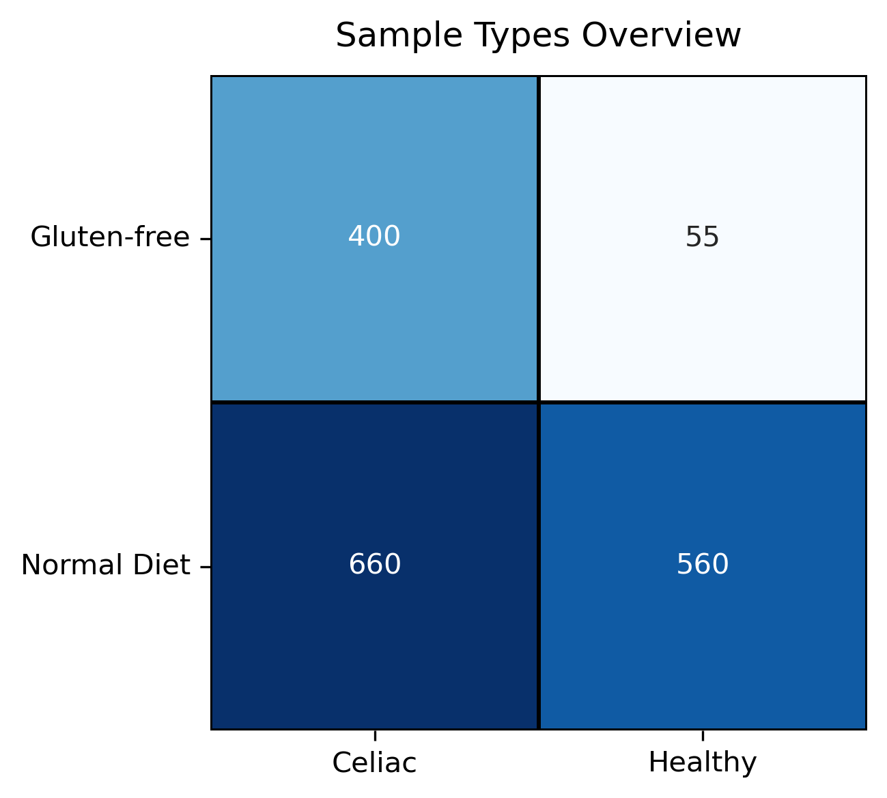

# The Celiac Microbiome Repository

## About

### The Celiac Microbiome Repository
The **Celiac Microbiome Repository (CMR)** is the best effort to comprehensively combine all high throughput sequencing datasets of the gut microbiome related to celiac disease. The current version of The Celiac Microbiome Repository (CMR) is **version 1.0**, which was up to date as of **10th September 2024**. The CMR is a continuous project made to be easily updated as new data rapidly becomes available.

### Criteria for inclusion
This repository targets 16S rRNA and whole metagenomic sequencing datasets of the human gut microbiome described in peer-reviewed publications, which include *in vivo* samples of individuals who are diagnosed with or will be diagnosed with celiac disease. Both raw sequencing reads and basic sample metadata must be avaliable for inclusion.

### The CMR Web App
Our [R Shiny web application](https://celiac.shinyapps.io/celiac-webapp/) draws on the CMR's data, allowing for visualisation and exploration. The code behind this site is open source: [Webapp GitHub](https://github.com/CeliacMicrobiomeRepo/celiac-webapp/tree/main)

### Publication
In [this work](https://paper.link), by utilising 16S data from the CMR we investigated the stool and duodenal microbiomes of individuals with celiac disease across the globe. Analysis involved differential abundance analysis, comparison of diversity metrics, co-occurrence network analysis, and machine learning prediction of celiac disease. 

### Future of The CMR and Collaboration
In recent years the available celiac microbiome data has doubled every ~2 years. If this continues, it will become increasingly challenging to comprehensively combine all of this data. However, continuing the efforts of the CMR would provide an ongoing structured collection of this data in an open source manner which saves repeated efforts.

If you are interested in extending the CMR, please get in touch (haig.bishop@pg.canterbury.ac.nz). This would involve a new literature search, processing of the data (likely using the existing pipeline), and documentation of the new version.

## Current Version (v1.0)

### Version Overview
Version 1.0 (up to date as of September 10th, 2024) represents the initial comprehensive release of the celiac disease gut microbiome repository. This version includes all eligible and obtainable studies published before September 10, 2024, comprising 25 included datasets across 12 countries and 5 sample sites. These datasets contain a total of 1,060 samples from individuals diagnosed with celiac disease, and 74 from individuals who would go on to develop celiac disease.

Below are visualisations summarising the data in CMR version 1.0.

  
  

  
  

### Version Documentation
Details on the current version are available on this page: [Version 1.0 Documentation](version_docs/repo_version_1.0.md).

## Contents

### Metadata
 - `included_datasets.tsv` - Contains all datasets that were included in the current version.
 - `excluded_datasets.tsv` - Contains all datasets/studies that were not able to be included despite being eligible.
 - `all_samples.tsv` - Contains all samples in the datasets in `included_datasets.tsv`.
 - `low_read_samples.tsv` - Contains all samples in `all_samples.tsv` with final read counts after DADA2 less than 1000.

### Raw Reads
The raw reads for most datasets are available on the SRA (find the SRA references in `included_datasets.tsv`). However, there were three exception in version 1.0:
 - `16S_119_Salamon` - This raw data is available on [this public database](https://portalwiedzy.cm-uj.krakow.pl/info/researchdata/UJCM77a8979a493e4aacbdceefa5121abbff/)
 - `16S_27_Fornasaro` - This raw data was obtained direct from the authors.
 - `16S_5_Senicar` - This raw data was obtained direct from the authors.

### 16S_preprocessing_scripts/
The `16S_preprocessing_scripts` directory contains all Python and R scripts using in the processing of 16S sequencing data.
 - `01_download_trim_sra.py` - Script to auto download from SRA and optionally trim adapters
 - `02_dada2_pipeline_454.R` - Script to run DADA2 (optimised for 454)
 - `02_dada2_pipeline_ion_torrent.R` - Script to run DADA2 (optimised for ion torrent)
 - `02_dada2_pipeline_paired_end.R` - Script to run DADA2 (optimised for Illumina paired end)
 - `02_dada2_pipeline_single_end.R` - Script to run DADA2 (optimised for Illumina single end)

### 16S_Datasets/
The `16S_datasets` directory contains all 16S rRNA sequencing datasets as subdirectories. Each dataset subdirectory contains the following files, largely outputs of DADA2.
- `SraAccList.csv` - A list of sample accessions from SRA
- `SraAccListReduced.csv` - Same as `SraAccList.csv` with unused samples removed
- `SraRunTable.csv` - A table of sample metadata from SRA
- `SraRunTableReduced.csv` - Same as `SraRunTable.csv` with unused samples removed
- `sra_result.csv` - A table of sample metadata from SRA
- `sra_resultReduced.csv` - Same as `sra_result.csv` with unused samples removed
- `other_metadata/` - Contain other metadata files (e.g. from authors or papers)
- `plots/` - Contains plots generated from DADA2 script
- `asv_abundances.tsv` - The ASV abundance table from DADA2 script
- `asv_abundances_transposed.tsv` - Same as `asv_abundances.tsv` but transposed
- `filter_summary.tsv` - Number of reads filtered for every fastq file
- `tracking_reads.tsv` - Number of reads at each step of DADA2 for every sample
- `sequence_lengths.tsv` - The lengths of all ASVs before applying length filter
- `taxonomy.tsv` - Taxonomic identifications of all ASVs
- `seqs.fna` - All ASV sequences in FASTA format

### SG_preprocessing_scripts/
The `SG_preprocessing_scripts` directory contains Python scripts used for processing shotgun metagenomic sequencing data. 
 - `01_download_trim_sra.py` - Script to automatically download raw reads from SRA and perform adapter/quality trimming using Trimmomatic and/or Cutadapt (similar to the 16S version).
 - `02_host_read_removal.py` - Script to remove host (human) reads from the trimmed FASTQ files using Bowtie2 alignment against a human reference genome. Outputs non-host FASTQ files.
 - `03_tax_profiling.py` - Script to perform taxonomic profiling on the host-removed reads using MetaPhlAn 4. Outputs individual sample profiles and a merged abundance table per dataset.

### SG_datasets/
The `SG_datasets` directory contains processed shotgun metagenomic sequencing datasets as subdirectories. Each dataset subdirectory contains the following files and subdirectories, generated by the `SG_preprocessing_scripts`:
- `SraAccList.csv` - A list of sample accessions from SRA
- `SraAccListReduced.csv` - Same as `SraAccList.csv` with unused samples removed
- `SraRunTable.csv` - A table of sample metadata from SRA
- `SraRunTableReduced.csv` - Same as `SraRunTable.csv` with unused samples removed
- `sra_result.csv` - A table of sample metadata from SRA
- `sra_resultReduced.csv` - Same as `sra_result.csv` with unused samples removed
- `other_metadata/` - Contains other metadata files (e.g., from authors or papers).
- `host_removed_fastqs/` - Contains outputs from Bowtie2 (generated by `02_host_read_removal.py`).
    - `<sampleID>_2_bowtie2.log` - Log file for every Bowtie2 sample run.
- `about_host_read_removal.tsv` - Table with results from host read removal (read counts).
- `metaphlan_outputs/` - Contains outputs from MetaPhlAn (generated by `03_tax_profiling.py`).
    - `<sampleID>_profile.txt` - Individual sample taxonomic profile.
- `merged_taxonomic_profile.tsv` - Merged table of taxonomic abundances for all samples in the dataset.

## Requirements & Licenses

The code within this repository is licensed under the **GNU Affero General Public License v3.0 (AGPL-3.0)** (see the `LICENSE` file).

The scripts rely on several external tools and libraries, each with its own license:

### Python
[Python 3.12](https://www.python.org/downloads/release/python-3120/) was used for some scripts in this repository. Packages utilised include:
 - `pandas` ([BSD 3-Clause](https://github.com/pandas-dev/pandas/blob/main/LICENSE))
 - `geopandas` ([BSD 3-Clause](https://github.com/geopandas/geopandas/blob/main/LICENSE.txt))
 - `shapely` ([BSD 3-Clause](https://github.com/shapely/shapely/blob/main/LICENSE.txt))
 - `matplotlib` ([PSF license](https://github.com/matplotlib/matplotlib/blob/main/LICENSE/LICENSE))
 - `seaborn` ([BSD 3-Clause](https://github.com/mwaskom/seaborn/blob/master/LICENSE.md))
 - `Pillow` ([MIT-CMU](https://github.com/python-pillow/Pillow/blob/main/LICENSE))

### R
[R version 4.4](https://www.r-project.org/) was used for many scripts in this repository. Packages utilised include:
 - `phyloseq` ([AGPL-3](https://www.bioconductor.org/packages/release/bioc/html/phyloseq.html))
 - `dada2` ([LGPL-3.0](https://github.com/benjjneb/dada2/blob/master/LICENSE))
 - `ggplot2` ([MIT](https://github.com/tidyverse/ggplot2/blob/main/LICENSE.md))
 - `Biostrings` ([Artistic License 2.0](https://bioconductor.org/packages/release/bioc/html/Biostrings.html))

### SRAtoolkit (v3.1.1)
[SRAtoolkit](https://github.com/ncbi/sra-tools/wiki/02.-Installing-SRA-Toolkit) was used for downloading raw reads from NCBI SRA. (License: [Public Domain - U.S. Government Work](https://github.com/ncbi/sra-tools/blob/master/LICENSE))

### FastQC (v0.12.1)
[FastQC](https://www.bioinformatics.babraham.ac.uk/projects/fastqc/) was used for checking for the presence of adapter sequences. (License: [GPL v3.0](https://github.com/s-andrews/FastQC/blob/master/LICENSE.txt))

### Trimmomatic (v0.39)
[Trimmomatic](https://github.com/usadellab/Trimmomatic/releases) was used for trimming adapter sequences from raw reads. (License: [GPL v3.0](https://github.com/usadellab/Trimmomatic/blob/main/LICENSE))

### Cutadapt (v5.0)
[Cutadapt](https://cutadapt.readthedocs.io/en/stable/installation.html) was used for trimming adapter sequences from raw reads. (License: [MIT](https://github.com/marcelm/cutadapt/blob/main/LICENSE))

### DADA2 (v1.26.0)
[DADA2](https://benjjneb.github.io/dada2/tutorial.html) was used for processing raw 16S reads into ASVs and abundances. (License: [LGPL-3.0](https://github.com/benjjneb/dada2/blob/master/LICENSE))

### Bowtie2 (v2.5.4)
[Bowtie2](https://bowtie-bio.sourceforge.net/bowtie2/index.shtml) was used for host read removal and as a dependency of MetaPhlAn. (License: [GPLv3](https://github.com/BenLangmead/bowtie2/blob/master/LICENSE))

### MetaPhlAn4 (v4.1.1)
[MetaPhlAn4](https://huttenhower.sph.harvard.edu/metaphlan/) was used for taxonomic profiling of shotgun metagenomic data. (License: [MIT](https://github.com/biobakery/MetaPhlAn/blob/master/license.txt))

## Authors
- **Haig Bishop**:    haig.bishop@pg.canterbury.ac.nz
- **Peter Prendergast**:    peter.prendergast@pg.canterbury.ac.nz
