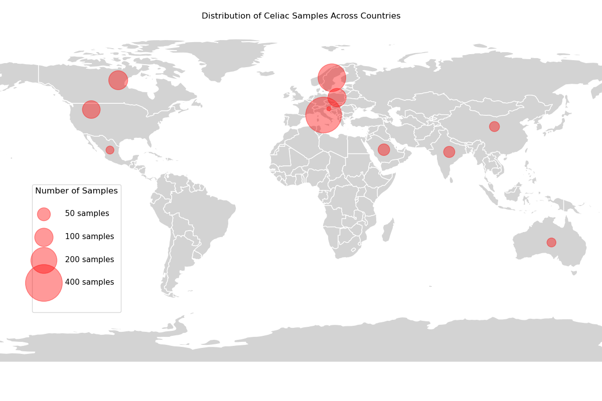
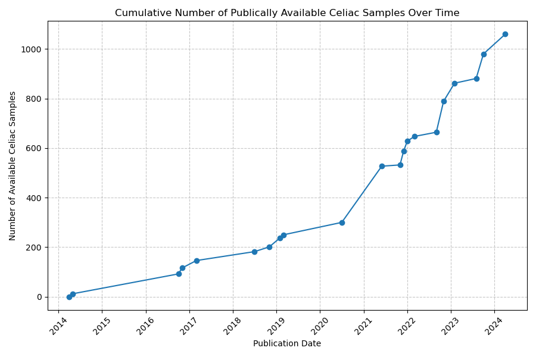

# Celiac Microbiome Repository Version 1.0 Documentation
- **Author:** Haig Bishop
- **Date:** 7th Apr 2025
- **Repository Version:** 1.0
- **Literature Search Date:** 10th Sep 2024
- **Description:** This is the documentation for CMR v1.0 containing descriptions of inclusion criteria, literature searches, data collection, processing methods, and resulting data.

---

## Version 1.0 Overview
Celiac Microbiome Repository (CMR) Version 1.0 (up to date as of September 10th, 2024) represents the initial comprehensive release of the celiac disease gut microbiome repository. This version includes all eligible and obtainable studies published before September 10, 2024, comprising 25 included datasets across 12 countries and 5 sample sites. These datasets contain a total of 1,060 samples from individuals diagnosed with celiac disease, and 74 from individuals who would go on to develop celiac disease.

### Data Summary (CMR v1.0)
The final repository (v1.0) includes 25 datasets:
- **Total Samples:** The repository includes 2,982 samples (before any exclusion based on metadata/low reads). Comprising 1,060 celiac disease samples and 74 prospective celiac disease samples.
- **Countries:** Samples originate from 12 different countries: USA, China, Italy, India, Poland, Mexico, Australia, Canada, Spain, Saudi Arabia, Sweden and Slovenia.
- **Sample Sites:** 5 unique body sites are represented: Stool (2370 samples), Duodenum (410 samples), Saliva (87 samples), Stomach (60 samples), Oropharynx (56 samples).
- **Sequencing Type:** There are 23 datasets using 16S rRNA sequencing (2,770 samples), and 2 datasets using shotgun metagenomics (212 samples).
- **16S Platform:** Illumina MiSeq was the dominant platform for 16S data (89.4% of samples).
- **16S Region:** Seven unique 16S rRNA variable regions were targeted. The V3-V4 region was most common (75% of samples), followed by V4 (13%) and V3 (8%).

### Data Visualisations (CMR v1.0)

  
  

  
  

## Dataset Naming
Datasets are given a unique ID of the format: 

`<SequencingType>_<NSamples>_<AuthorLastName>`

Where:
- **`<SequencingType>`:** Indicates the sequencing method used ('16S' for 16S rRNA or 'SG' for Whole Genome Shotgun metagenomics).
- **`<NSamples>`:** A unique numerical identifier assigned to the dataset within the CMR.
- **`<AuthorLastName>`:** The last name of the first author of the associated publication.

## Acronyms
- **16S:** 16S ribosomal RNA gene sequencing
- **SG:** Shotgun Metagenomics
- **CD:** Celiac Disease
- **GFD:** Gluten-Free Diet
- **ACD / CD_GD:** Active Celiac Disease / Celiac Disease on Gluten Diet (i.e., not on a GFD)
- **TCD / CD_GFD:** Treated Celiac Disease / Celiac Disease on Gluten-Free Diet
- **HC:** Healthy Control

## Inclusion Criteria
Studies/datasets were included in the Celiac Microbiome Repository (CMR) v1.0 if they met the following criteria:
- Investigated the human gut microbiome using high-throughput sequencing (16S rRNA or shotgun metagenomics).
- Included *in vivo* samples from individuals diagnosed with or prospectively diagnosed with celiac disease.
- Published in a peer-reviewed journal before the literature search cut-off date.
- Made raw sequencing reads publicly available or obtainable upon request.
- Provided basic sample metadata necessary for interpretation (specifically: celiac disease diagnosis status, gluten-free diet status, and body site).

## Literature Search
A systematic literature search was conducted on **September 10th, 2024**, targeting peer-reviewed publications describing 16S rRNA or shotgun metagenomic sequencing of the human gut microbiome in celiac disease. Searches were performed on:
- **NCBI Sequence Read Archive (SRA):** 
  - Keywords "celiac", "coeliac", "gluten enteropathy", or "sprue" 
  - Yielded 162 results, with 26 meeting inclusion criteria.
- **Scopus:** 
  - Keywords ("celiac", "coeliac", "gluten enteropathy" or "sprue") AND ("metagenomic", "microbiome", "microbiota", "16s", "rRNA", "shotgun", "sequencing" or "metagenomics"), limited to Articles
  - Yielded 845 publications, with 27 being additional eligible studies not found via SRA.
- **Qiita redbiom:** 
  - Search for ("celiac | coeliac | enteropathy | sprue") 
  - Yielded no additional eligible datasets.

In total, 53 eligible datasets were identified through these searches.

## Datasets Exclusion
Of the 53 eligible datasets identified, 28 were excluded. Details on all excluded datasets and the specific reasons for exclusion are provided in `excluded_datasets.tsv`. The most common reason for exclusion was the unavailability of raw sequencing data combined with a lack of response (after up to three email attempts) to requests sent to corresponding authors. Other reasons included:
- Privacy controls on data (confirmed by authors)
- Large fees to obtain and use data
- Data lost (confirmed by authors)
- Insufficient metadata (combined with lack of response from authors)

## Obtaining Raw Sequencing Data
Raw sequencing data for included datasets were obtained through various means:
- **Sequence Read Archive (SRA):** Data for most datasets were downloaded directly from the NCBI SRA using the SRA Toolkit (facilitated by the script `16S_preprocessing_scripts/01_download_trim_sra.py`). SRA accession numbers for each dataset can be found in `included_datasets.tsv`.
- **Other Public Repositories:** The `16S_119_Salamon` dataset was available on another [public database](https://portalwiedzy.cm-uj.krakow.pl/info/researchdata/UJCM77a8979a493e4aacbdceefa5121abbff/).
- **Direct Author Contact:** For datasets where raw data was not publicly archived (25 such cases identified), corresponding authors were contacted via email up to three times. Raw data was successfully obtained via email for 2 of these: `16S_27_Fornasaro` and `16S_5_Senicar`.

## Obtaining Metadata
Metadata for samples was gathered from multiple sources:
- **SRA Metadata:** Metadata tables provided alongside SRA submissions (e.g., `SraRunTable.csv`, `sra_result.csv` found within each dataset directory in `16S_Datasets/`).
- **Publication Information:** Details extracted directly from the associated peer-reviewed publications and their supplementary materials. If used, these files can be found in each dataset's `other_metadata/` directory.
- **Author Communication:** Additional metadata or clarifications obtained through direct communication with study authors. If used, these files can be found in each dataset's `other_metadata/` directory.

Key metadata fields collected for all samples included: sample site, celiac diagnosis, gluten-free diet status, prospective diagnosis status (if applicable), sequencing technology and country. Where possible, additional fields like age, sex, DNA extraction kit, and 16S primers used were also recorded. Collected metadata was compiled and standardized across datasets, available in `all_samples.tsv`.

## Sample Exclusions
With one exception, all samples from all included datasets can be found in `all_samples.tsv`, regardless of quality, read counts or confounding factors. The exception is that 20 healthy control samples from `16S_179_Verdu` were excluded because they targeted a different 16S rRNA amplicon region to all other samples making processing far simpler.

For downstream uses samples can be filtered according to factors such as:
- **Low Read Counts:** Samples with fewer than 1,000 reads remaining after the DADA2 pipeline and listed in `low_read_samples.tsv`.
- **Confounding Factors:** Potentially confounding factors are recorded in `all_samples.tsv`, including recent short-term gluten challenges, Non-Celiac Gluten Sensitivity (NCGS), possible celiac disease status, recent hookworm infection, or other autoimmune diseases.

## Processing of 16S Data
16S rRNA sequencing data underwent a standardized preprocessing pipeline:
1.  **Data Download:** Raw reads were downloaded as described above (usually via `01_download_trim_sra.py`).
2.  **Quality Control & Adapter Trimming:** FastQC was used to assess read quality and identify adapter sequences. If adapters were present, Trimmomatic or Cutadapt was used for removal based on the specific adapter content. Trimming parameters and decisions are documented in `included_datasets.tsv`.
3.  **DADA2 Pipeline:** Amplicon Sequence Variants (ASVs) were inferred using the DADA2 R package. Separate DADA2 scripts optimised for different sequencing technologies used used:
    - `02_dada2_pipeline_paired_end.R` (Illumina Paired-End)
    - `02_dada2_pipeline_single_end.R` (Illumina Single-End)
    - `02_dada2_pipeline_454.R` (Roche 454)
    - `02_dada2_pipeline_ion_torrent.R` (Ion Torrent)

    These (very similar) scripts implement the standard DADA2 pipeline, with different parameters used for each dataset (documented in `included_datasets.tsv`). Theses DADA2 scripts resulted in several output files found in `16S_datasets/`, with the main result being ASVs, relative abundances of the ASVs and their taxonomic assignments (using the SILVA database (v138.1)).

## Processing of Shotgun Data
Shotgun metagenomic sequencing data underwent the following processing steps:

1.  **Data Acquisition:** Raw paired-end shotgun reads were obtained for both datasets from the SRA. Adapter trimming performed prior to CMR processing is recorded in `included_datasets.tsv`.
2.  **Host Read Removal:** Reads were screened against the human reference genome (GRCh38_noalt_decoy_as) using Bowtie2 (v2.5.4) via the `02_host_read_removal.py` script. This step aligns reads to the host genome and retains only the unaligned (non-host) read pairs. The sensitivity parameter used for alignment was `--sensitive-local`. 
3.  **Taxonomic Profiling:** The non-host paired-end reads were processed with MetaPhlAn (v4.1.1) using the `03_tax_profiling.py` script. The specific MetaPhlAn database used was mpa_vJun23_CHOCOPhlAnSGB_202403_bt2. Individual sample profiles were outputted to the `metaphlan_output/` subdirectory (e.g., `sampleID_profile.txt`).
4.  **Profile Merging:** Individual sample taxonomic profiles generated by MetaPhlAn for each dataset were merged into a single abundance table (`merged_taxonomic_profile.tsv`). This merged table is located in each shotgun dataset's directory.

### 16S Data Results
The `16S_datasets` directory contains all 16S rRNA sequencing datasets as subdirectories. Each dataset subdirectory contains the following files, largely outputs of DADA2.
- `SraAccList.csv` - A list of sample accessions from SRA
- `SraAccListReduced.csv` - Same as `SraAccList.csv` with unused samples removed
- `SraRunTable.csv` - A table of sample metadata from SRA
- `SraRunTableReduced.csv` - Same as `SraRunTable.csv` with unused samples removed
- `sra_result.csv` - A table of sample metadata from SRA
- `sra_resultReduced.csv` - Same as `sra_result.csv` with unused samples removed
- `other_metadata/` - Contain other metadata files (e.g. from authors or papers)
- `plots/` - Contains plots generated from DADA2 script
- `asv_abundances.tsv` - The ASV abundance table from DADA2 script
- `asv_abundances_transposed.tsv` - Same as `asv_abundances.tsv` but transposed
- `filter_summary.tsv` - Number of reads filtered for every fastq file
- `tracking_reads.tsv` - Number of reads at each step of DADA2 for every sample
- `sequence_lengths.tsv` - The lengths of all ASVs before applying length filter
- `taxonomy.tsv` - Taxonomic identifications of all ASVs
- `seqs.fna` - All ASV sequences in FASTA format

## Shotgun Data Results
The `SG_datasets` directory contains processed shotgun metagenomic sequencing datasets as subdirectories. Each dataset subdirectory contains the following files and subdirectories, generated by the `SG_preprocessing_scripts`:
- `SraAccList.csv` - A list of sample accessions from SRA
- `SraAccListReduced.csv` - Same as `SraAccList.csv` with unused samples removed
- `SraRunTable.csv` - A table of sample metadata from SRA
- `SraRunTableReduced.csv` - Same as `SraRunTable.csv` with unused samples removed
- `sra_result.csv` - A table of sample metadata from SRA
- `sra_resultReduced.csv` - Same as `sra_result.csv` with unused samples removed
- `other_metadata/` - Contains other metadata files (e.g., from authors or papers).
- `host_removed_fastqs/` - Contains outputs from Bowtie2 (generated by `02_host_read_removal.py`).
    - `<sampleID>_2_bowtie2.log` - Log file for every Bowtie2 sample run.
- `about_host_read_removal.tsv` - Table with results from host read removal (read counts).
- `metaphlan_outputs/` - Contains outputs from MetaPhlAn (generated by `03_tax_profiling.py`).
    - `<sampleID>_profile.txt` - Individual sample taxonomic profile.
- `merged_taxonomic_profile.tsv` - Merged table of taxonomic abundances for all samples in the dataset.

## Dataset Metadata Files
High-level metadata regarding the datasets included in or excluded from CMR v1.0 are provided in the following files at the repository root:

### `included_datasets.tsv`
Lists all datasets included in this version, along with key information like publication details, SRA references, sample counts, country, and sample site(s). It contains the following columns:
  - `Dataset_ID`: Unique identifier assigned to the dataset within the CMR.
  - `Bioproject_ID`: NCBI BioProject ID associated with the dataset, if available.
  - `Record_Link`: URL link to the primary data record (e.g., NCBI BioProject, specific database).
  - `Publication_Title`: Title of the associated peer-reviewed publication.
  - `Publication_Link`: URL link to the publication page.
  - `Month_Of_Publication`: Month and year the study was published (e.g., Dec-21).
  - `DOI`: Digital Object Identifier for the publication.
  - `Used_In_Previous_Meta_Analysis`: Indicates if the dataset was included in known prior meta-analyses (TRUE/FALSE).
  - `Lit_Search_Source`: The database where the study was initially identified (e.g., 'NCBI SRA', 'Scopus').
  - `Data_Source`: How the raw sequencing data was obtained (e.g., 'NCBI SRA', 'Shared via email').
  - `Sequencing_Type`: High-throughput sequencing method used ('16S' or 'SG').
  - `Sequencing_Technology`: Specific sequencing platform used (e.g., 'Illumina MiSeq', 'Ion Torrent').
  - `Prospective_Study`: Indicates if the study design was prospective (TRUE/FALSE).
  - `Sample_Sites`: Body site(s) from which samples were collected (e.g., 'stool', 'duodenum', 'stool|duodenum').
  - `Amplicon_Region`: Targeted 16S rRNA variable region(s) (e.g., 'V3-V4', 'V4'). 'NA' for shotgun data.
  - `V1`: Boolean flag indicating if the V1 16S variable region was targeted (TRUE/FALSE).
  - `V2`: Boolean flag indicating if the V2 16S variable region was targeted (TRUE/FALSE).
  - `V3`: Boolean flag indicating if the V3 16S variable region was targeted (TRUE/FALSE).
  - `V4`: Boolean flag indicating if the V4 16S variable region was targeted (TRUE/FALSE).
  - `V5`: Boolean flag indicating if the V5 16S variable region was targeted (TRUE/FALSE).
  - `V6`: Boolean flag indicating if the V6 16S variable region was targeted (TRUE/FALSE).
  - `Forward_Primer`: Forward primer sequence used for amplification, if reported.
  - `Reverse_Primer`: Reverse primer sequence used for amplification, if reported.
  - `DNA_Extraction_Kit`: DNA extraction kit used, if reported.
  - `Read_Pairing`: Indicates if sequencing reads were paired-end ('paired') or single-end ('single').
  - `Trimming_Of_Reads_After_Acquisition`: Indicates if any trimming was performed after data acquisition but before CMR processing (TRUE/FALSE or specific tool).
  - `Bowtie2_Alignment_Sensitivity`: Sensitivity preset used for Bowtie2 alignment in host read removal for shotgun data.
  - `Host_Genome_Index`: Reference genome index used for host read removal.
  - `MetaPhlAn_Database`: Specific database version used for taxonomic profiling with MetaPhlAn in shotgun data.
  - `Fw_Read_Trim_Position`: Forward read trimming length/position used in DADA2, if applicable.
  - `Rv_Read_Trim_Position`: Reverse read trimming length/position used in DADA2, if applicable.
  - `ASV_Table_Length_Filter`: Specific length filter applied to the ASV table post-DADA2, if any.
  - `Notes_From_Processing`: Any relevant notes made during data processing.
  - `Age_Range`: Age range of participants in the study, if reported.
  - `Num_Samples_Processed_And_With_Metadata`: Total number of samples from this dataset included in the final CMR.
  - `Num_Individuals_Processed_And_With_Metadata`: Total number of unique individuals represented by the included samples.
  - `Num_Celiac_Samples_Processed_And_With_Metadata`: Number of samples from diagnosed celiac individuals.
  - `Num_GFD_Samples_Processed_And_With_Metadata`: Number of samples from individuals on a gluten-free diet.
  - `Num_Prospective_Celiac_Samples_Processed_And_With_Metadata`: Number of samples from individuals who later developed celiac disease (in prospective studies).
  - `Longitudinal_Study`: Indicates if the study involved sampling the same individuals at multiple time points (TRUE/FALSE).
  - `Country`: Country where the study was conducted/samples collected.
  - `Samples_With_Significant_Factors`: Lists potential confounding factors present in some samples (e.g., 'gluten challenge', 'NCWS').
  - `Prospective_Studies`: Boolean flag indicating a prospective study design (TRUE/FALSE).
  - `Shotgun_Studies`: Boolean flag indicating a shotgun metagenomics dataset (TRUE/FALSE).
  - `Study_Design_Description`: Brief textual description of the study's design and comparison groups.

### `excluded_datasets.tsv`
Lists datasets that were identified as eligible but excluded, along with the primary reason for exclusion. It contains the following columns:
  - `Publication_Title`: The title of the peer-reviewed publication associated with the dataset.
  - `Publication_Link`: A URL linking to the publication page.
  - `Month_Of_Publication`: The month and year the study was published (e.g., Jun-23).
  - `DOI`: The Digital Object Identifier for the publication.
  - `Record_Link`: A URL linking to the dataset record in a public repository (e.g., SRA), if applicable.
  - `Project_ID`: The unique identifier for the project in a public repository (e.g., SRA BioProject ID like PRJNA######), if applicable.
  - `Lit_Search_Source`: The database where the study was initially identified (e.g., 'NCBI SRA', 'Scopus').
  - `Data_Availability`: Status indicating whether the raw sequencing data was accessible (e.g., 'unavailable', 'listed on SRA', 'available on SRA').
  - `Reason_For_Exclusion`: The specific reason why the dataset was not included in the CMR (e.g., 'no email response', 'privacy controls', 'large fees').
  - `Sequencing_Type`: The high-throughput sequencing method used ('16S' or 'SG').

## Sample Metadata Files
Detailed metadata for individual samples across all included datasets are provided in the following files at the repository root:

### `all_samples.tsv`
Contains metadata for every sample included in CMR v1.0. The file contains the following columns:
  - `Sample_ID`: Unique identifier assigned to each sample within the CMR.
  - `Dataset_ID`: Unique identifier for the dataset the sample belongs to.
  - `SRA_Run_ID`: Sequence Read Archive (SRA) run accession number for the sample.
  - `SRA_Project_ID`: SRA BioProject accession number for the study.
  - `Month_of_Publication`: Month and year the associated study was published (e.g. Feb-19).
  - `Publication_DOI`: Digital Object Identifier (DOI) for the associated publication.
  - `Sequencing_Type`: The sequencing method used ('16S' or 'SG').
  - `Amplicon_Region`: The targeted 16S rRNA variable region(s) (e.g., 'V3-V4', 'V4'). 'NA' for shotgun data.
  - `Seq_Depth_Filtered`: The number of sequencing reads remaining after DADA2 processing (quality filtering, chimera removal, etc.). 'NA' for shotgun data.
  - `Seq_Tech`: The specific sequencing technology used (e.g., 'Illumina MiSeq', 'Pyrosequencing').
  - `DNA_Ext_Kit`: The DNA extraction kit used, if reported. 'unavailable/unclear' otherwise.
  - `Paired_Reads`: Indicates if sequencing was paired-end ('TRUE') or single-end ('FALSE').
  - `Sample_Site`: The body site from which the sample was collected (e.g., 'stool', 'duodenum').
  - `Diagnosed_Celiac`: Indicates if the individual was diagnosed with celiac disease at the time of sampling ('TRUE', 'FALSE').
  - `Gluten_Free_Diet`: Indicates if the individual was adhering to a gluten-free diet (GFD) ('TRUE' or 'FALSE').
  - `Group`: A simplified grouping based on diagnosis and diet ('CD_GFD' for celiac on a GFD, 'CD_GD' for celiac on no GFD, 'HC' for Healthy Control, 'NA' for prospective study).
  - `Will_Develop_Celiac`: In prospective studies, indicates if the individual later developed celiac disease ('TRUE', 'FALSE', 'NA').
  - `Group_Prospective_Study`: Simplified grouping for prospective studies ('Prospective_CD' for individuals who **will** develop celiac, 'Prospective_HC' for individuals who **will not** develop celiac, 'NA' for non-prospective study).
  - `Short_term_Gluten_Challenge`: Indicates if the sample was taken during or shortly after a short-term gluten challenge ('TRUE', 'FALSE').
  - `NCGS`: Indicates if the individual was diagnosed with Non-Celiac Gluten Sensitivity ('TRUE', 'FALSE').
  - `Other_Autoimmune`: Indicates if the individual had other reported autoimmune diseases ('TRUE', 'FALSE').
  - `Hookworm`: Indicates if the individual had a recent or current hookworm infection ('TRUE', 'FALSE').
  - `Possible_Celiac`: Indicates if the diagnosis was reported as 'possible' or 'potential' celiac disease ('TRUE', 'FALSE').
  - `Any_Significant_Factor`: A summary flag ('TRUE'/'FALSE') indicating the presence of any potentially confounding factors (Gluten Challenge, NCGS, Other Autoimmune, Hookworm, Possible Celiac).
  - `Country`: The country where the sample was collected.
  - `Age`: The age of the individual at the time of sampling, if reported. 'unknown' otherwise.
  - `Sex`: The sex of the individual, if reported ('Male', 'Female', 'unknown').

### `low_read_samples.tsv`
Lists samples from `all_samples.tsv` that had fewer than 1,000 reads after the DADA2 processing pipeline, which may be excluded from downstream analyses. It contains the following columns:
  - `Dataset_ID`: The unique identifier for the dataset the sample belongs to.
  - `Sample_ID`: The unique identifier assigned to the sample within the CMR.
  - `Number_Of_Reads_Nonchim`: The number of reads remaining for this sample after DADA2 processing (originating from the sample's `tracking_reads.tsv` file).
